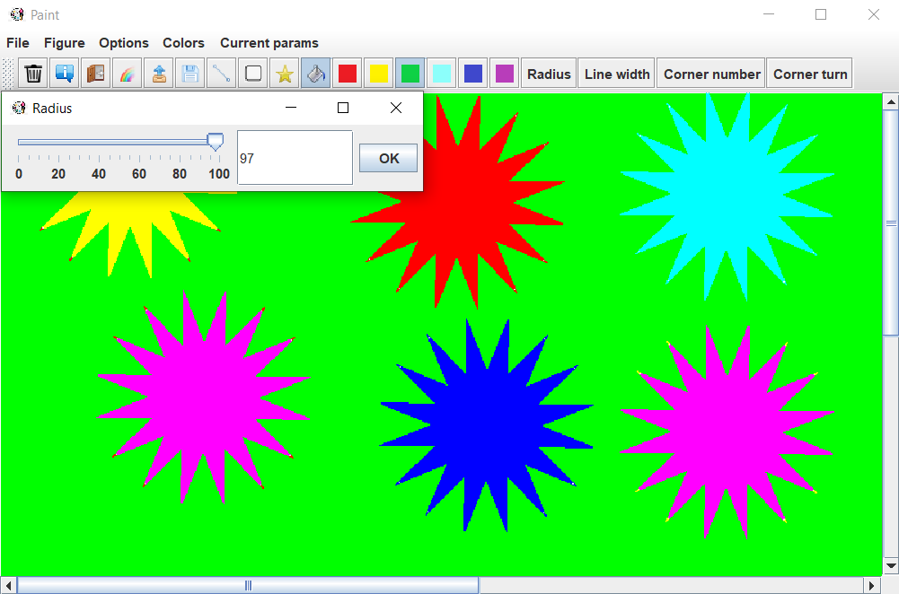

# Paint-Graphics_1
Application which is a copy of paint from Microsoft.
This app made using: Swing Java, lombok, pom.xml



This app contains 3 types of actions:
1) draw line (using Bresenham algorithm) with changeable length
2) draw n-corner figures, and stars with changeable count of corners, radius, turn
3) fill your picture (using span-fill algorithm)

## How to launch it

Go to project folder, using terminal. Then type
```
cd Paint
java -jar target/detector.jar
```
